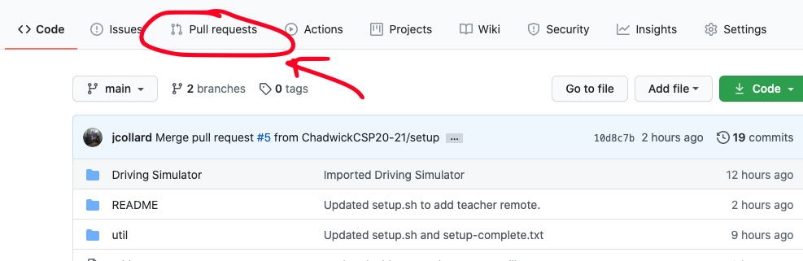
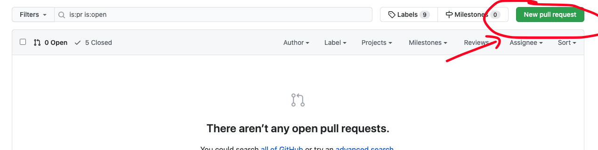
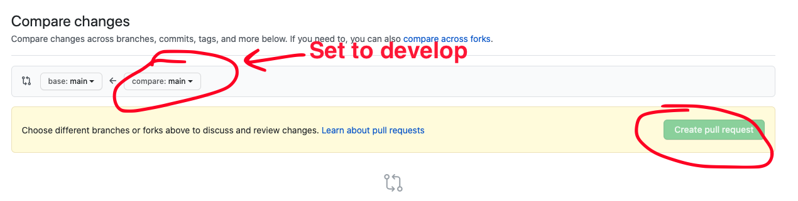
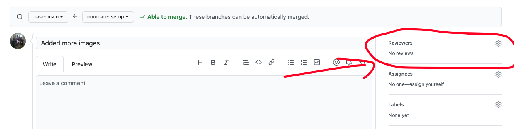
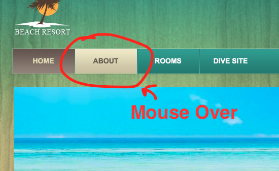

# Portfolio

## Overview

In this project, you will put your HTML and CSS skills to the test by creating a
website for a beach resort from a set of images. This is a very common practice.
Often, a client will provide you with a mock up of a site they would like to
create and you will need to translate it to HTML and CSS.

* [Setup your repository](#setup-your-repository)
  * [Sign up for the project](#sign-up-for-project)
* [Beach Resort Reference Files](#beach-resort-reference-files)
  * [Mouse Over CSS](#mosue-over-css)
* [Milestones](#milestones)
  * [Milestone 1](#milestone-1)
  * [Milestone 2](#milestone-2)
  * [Milestone 3](#milestone-3)
  * [Milestone 4](#milestone-4)
  * [Milestone 5](#milestone-5)
* [Grading](#grading)
  * [Computational Thinking](#computational-thinking)
  * [Computing, Programming and Practice](#computing-programming-and-practice)
  * [Skills of a Student](#skills-of-a-student)
* [Getting Help](#getting-help)

## Setup your repository

### Sign up for Project

Sign up for the project repository here:
[https://classroom.github.com/a/M6CiLTpi](https://classroom.github.com/a/M6CiLTpi)

After your repository has initialized it, clone it to your computer. I recommend
putting it in your `ap-csp` directory.

After you've cloned your repository, run the `setup.sh` script in the root of
that repository to initialize it's configuration.

Upon completion it should display a message similar to this one:

```
######################################################
# SETUP IS COMPLETE. YOU SHOULD NOW CREATE A         #
# `develop` BRANCH BY RUNNING THE FOLLOWING COMMAND: #
#                                                    #
# git checkout -b develop                            #
#                                                    #
# THEN PUSH THAT BRANCH TO GITHUB BY RUNNING THE     #
# FOLLOWING COMMAND:                                 #
#                                                    #
# git push -u origin develop                         #
#                                                    #
# AFTER PUSHING, OPEN A PULL REQUEST FROM YOUR       #
# `develop`  BRANCH TO THE `main` BRANCH BY VISITING #
# THIS REPO ON GITHUB, CLICKING `Pull Requests`      #
# THEN `New pull request`. THE BASE BRANCH SHOULD BE #
# `main` and THE COMPARE BRANCH SHOULD BE `develop`. #
#                                                    #
# FINALLY, ADD YOUR INSTRUCTOR AS A REVIEWER ON      #
# GITHUB. THIS IS HOW YOUR INSTRUCTOR WILL SEE YOUR  #
# WORK.                                              #
######################################################
```

Follow the directions to create a `develop` branch as well as pushing your
`develop` branch to Github.

Finally, create a pull request from your `develop` branch to the `main` branch
and assign `jcollard` as a reviewer.









## Beach Resort Reference Files

For this project, you are tasked with creating 7 html files. The overall look
and feel of each of these files are in the `references` directory of this
repository.

* [index.html](references/index.png)
* [about.html](references/about.png)
* [rooms.html](references/rooms.png)
* [dive.html](references/dive.png)
* [food.html](references/food.png)
* [news.html](references/news.png)
* [contact.html](references/contact.png)

### Mouse Over CSS

To receive the Advanced score on this project, you must implement CSS to make
various ares of the web page change when the mouse hovers over them.

W3Schools provides a pretty good set of examples on how to accomplish this in
different ways: [How TO - Image Hover
Overlay](https://www.w3schools.com/howto/howto_css_image_overlay.asp)

Here are a list of required hover elements to receive a full Advanced score:

* [Top Menu](references/hovers/top-menu.png)
* [Bottom Menu](references/hovers/bottom-menu.png)
* [Social Media Icons](references/hovers/social-media.png)
* [Food Option 1](references/hovers/food-1.png)
* [Food Option 2](references/hovers/food-2.png)
* [Food Option 3](references/hovers/food-3.png)

## Milestones

### Milestone 1

Due: Friday November 6th @ 8am

For the first Milestone: 

1. Create a `develop` branch
2. Create a Pull Request to your `develop` branch.
3. Create a new directory inside this repository called `resort`. 
4. Create an index HTML page with the same background as the [reference
   image](references/index.png)
5. Create a [Horizontal Navigation
   Bar](https://www.w3schools.com/css/css_navbar_horizontal.asp) containing an
   anchor tag for all 7 pages (the pages do not need to exist yet)

#### Tips for Completion:

All of the images used on this side are available in the `images` directory of
this repository. Images that will be useful to complete the index page:

* The background of the site is `bg-pattern.jpg`.
* The `bg-navigation.png` is used as a base for the menu. This isn't necessary,
  you may choose a solid color or a different pattern if you prefer.
* The `bg-menu.png` is used to create the gradient bars around the menu items.
  This is optional. You may choose a solid color if you prefer.

#### Bonus: Add Hover Colors to the Menu

To receive the Advanced score on this project, you will need to implement mouse
over interactions for the top menu. There is a tutorial for how you might
accomplish this on W3Schools: [How TO - Image Hover
Overlay](https://www.w3schools.com/howto/howto_css_image_overlay.asp)



All code that you would like to count toward your evaluation should be part of a
`tag` on in your repository called `milestone-1`. This can be created by running
`git tag milestone-1`. Then push your tag to your repository by running `git
push -u origin milestone-1` The date of this tag creation will be used to
determine when your work was submitted. 

### Milestone 2

Due: Thursday November 12th @ 8am

Finish the `index.html` page for the Beach Resort:

* Add in a [beach image](images/beach.jpg)
* Add in text to fill in the space. You can write your own promo text OR you can
  utilize the [Lorem Ipsum Generator](https://www.lipsum.com/).
* Add in a bottom navigation bar
* Bonus: Add Mouse Over to the bottom nav bar
* Bonus: Add social media links to the bottom nav bar

#### Bonus: Add Social Media Icons

There are social media icons in the provided `images` directory. They are all
included in a single file: `images/icons.png`.


Images being placed in a single file in this way are typically referred to as a
Sprite Sheet. W3Schools provides a tutorial for utilizing sprites in this way:
[CSS Image Sprites](https://www.w3schools.com/css/css_image_sprites.asp)

All code that you would like to count toward your evaluation should be part of a
`tag` on in your repository called `milestone-2`. This can be created by running
`git tag milestone-2`. Then push your tag to your repository by running `git
push -u origin milestone-2` The date of this tag creation will be used to
determine when your work was submitted. 

### Milestone 3

Duplicate the `index.html` file six times to create templates for the remaining
pages: `about.html`, `rooms.html`, `dive.html`, `food.html`, `news.html`,
`contact.html`.

Next, add content to two of these pages to match their reference file.

Due: Monday November 16th @ 8am

All code that you would like to count toward your evaluation should be part of a
`tag` on in your repository called `milestone-3`. This can be created by running
`git tag milestone-3`. Then push your tag to your repository by running `git
push -u origin milestone-3` The date of this tag creation will be used to
determine when your work was submitted. 

### Milestone 4

Complete content for at least 5 of the pages for the Beach Resort site.

Due: Thursday November 19th @ 8am

All code that you would like to count toward your evaluation should be part of a
`tag` on in your repository called `milestone-4`. This can be created by running
`git tag milestone-4`. Then push your tag to your repository by running `git
push -u origin milestone-4` The date of this tag creation will be used to
determine when your work was submitted. 

### Milestone 5

The entire beach resort site should be completed.

Due: Monday November 23rd @ 8am

All code that you would like to count toward your evaluation should be part of a
`tag` on in your repository called `milestone-5`. This can be created by running
`git tag milestone-5`. Then push your tag to your repository by running `git
push -u origin milestone-5` The date of this tag creation will be used to
determine when your work was submitted. 

## Grading

### Computational Thinking

In this assignment, you will demonstrate your understanding of basic HTML tags
and how they interact with CSS to create a rich user experience.

| Advanced                                                                      | Proficient                                                         | Basic                                                           | Below Basic                                                                 |
|-------------------------------------------------------------------------------|--------------------------------------------------------------------|-----------------------------------------------------------------|-----------------------------------------------------------------------------|
| Completes all 7 pages                                                         | Completes at least 5 pages                                         | Student successfully completes the index.html page              | Student does not create an index.html page that matches the reference image |
| Adds hover to all sections noted in [Mouse Over CSS](#mouse-over-css) section | Completes a functional Top Navigation Bar that works on all pages  | Student creates a css file that connects to the index.html page | Little or no CSS Styling                                                    |
| Adds Social Media Links to the bottom navigation bar                          | Completes a function Bottom Navigation Bar that works on all pages |                                                                 |                                                                             |

### Computing, Programming, and Practice

This section covers how organized and readable your code is as well as your
ability to follow the commit guidelines and templates.

| Advanced                                                                               | Proficient                                                       | Basic                                                           | Below Basic                                                                    |
|----------------------------------------------------------------------------------------|------------------------------------------------------------------|-----------------------------------------------------------------|--------------------------------------------------------------------------------|
| All of the student's HTML and CSS are well indented                                    | The majority of the HTML / CSS is well formatted and indented    |                                                                 | Students code is not well formatted                                            |
| Student provides ample comments in HTML to help keep sections organized and separated. | Student provides few comments in their HTML files                | Student wrote some comments                                     | Student did not write comments                                                 |
| Student provides comments in their CSS describing their styling choices                | Student provides few comments in their CSS Files                 |                                                                 |                                                                                |
| All of the students commits follow the commit message template.                        | Most of the students commits follow the commit message template. | Some of the students commits follow the commit message template | Few or none of the students commit messages follow the commit message template |

### Skills of a Student

Your skills of a student covers your StudentLog repository, your in class time
management, meeting deadlines, asking for help when needed, and helping others
when able.

| Advanced                                                                           | Proficient                   | Basic                                                    | Below Basic                                          |
|------------------------------------------------------------------------------------|------------------------------|----------------------------------------------------------|------------------------------------------------------|
| Manages time well in class, stays focused on work  at hand at all times            | Focuses on work in class     | Focuses at times, can get distracted                     | Uses class time poorly, is frequently distracted     |
| Meets all deadlines, on or ahead of schedule                                       | Meets deadlines              | Delivers close to deadline, may be late  by a day or two | Delivers work late or not at all                     |
| Advocates for self, seeks clarification when needed  and volunteers to help others | Seeks assistance when needed | Needs prompting to seek assistance                       | Does not seek assistance or ask for help when needed |

## Getting Help

All questions should be posted to the class Piazza board. You are also
encouraged to help other students who post on Piazza. When you post your
question, be sure to include as many details as possible for reproducing the
issue you're having.

Questions you should answer when asking a question include:

1. What are you trying to do?
2. What did you try?
3. What was the result?

Work hard to make sure the person trying to answer your question can reproduce
your error. Share your files so others can run exactly what you're running.

Also, include screenshot!

Formulating good questions is a good life long skill. You should try asking your
question on Piazza before seeking out synchronous time with Mx. Collard.
However, if you would like to meet to discuss synchronously, first, look at [Mx.
Collard's Calendar](http://tinyurl.com/mx-collard-calendar), then send them an
email with at least two proposed times you would like to meet.